<div align="center">
<!-- Header Banner -->


<!-- Typing Animation -->
<a href="https://github.com/ageless-h">
  
</a>

<br/>

<!-- Quick Badges -->
[](https://github.com/ageless-h?tab=followers)
[](https://github.com/ageless-h?tab=repositories)


</div>

---

## 🧑‍💻 About Me

```python
class Ageless:
    def __init__(self):
        self.role = "Blender × ComfyUI Ecosystem Developer"
        self.mission = "Bridging the gap between 3D creation and AI-powered workflows"
        self.languages = ["Python"]
        self.domains = ["3D Animation", "AI Generation", "Workflow Automation"]
        self.tools = ["Blender", "ComfyUI", "ZMQ", "MCP Protocol", "SSH Tunneling"]

    def current_focus(self):
        return [
            "🌉 Building seamless bridges between Blender and ComfyUI",
            "🤖 AI-assisted 3D automation via MCP protocol",
            "🎬 End-to-end animation production workflows",
            "📦 Growing the ComfyUI custom node ecosystem",
        ]
```

---

## 🏗️ Project Ecosystem

> *All my projects form a cohesive ecosystem connecting **3D Creation** with **AI Generation**.*

```mermaid
graph TB
    subgraph 3D["🎨 3D Creation"]
        B["Blender"]
    end

    subgraph BRIDGE["🌉 Bridge Layer"]
        BC["Blender-ComfyUI-Bridge<br/>Blender Addon · ZMQ · SSH Tunnel"]
        BCN["ComfyUI-Blender-Bridge-node<br/>ComfyUI Server Node"]
        MCP["blender-mcp<br/>MCP Protocol · 4-Layer · 26 Tools"]
    end

    subgraph AI["🤖 AI Workflow"]
        C["ComfyUI"]
    end

    subgraph NODES["📦 Custom Node Ecosystem"]
        AFA["ComfyUI-AFA<br/>AI For Animation"]
        DM["ComfyUI_Data_Manager<br/>Visual File Manager"]
        IS["ComfyUI-ImageSimilarity<br/>Perceptual Hash"]
        LP["ComfyUI-LodaPrompt<br/>Danbooru Prompt Gen"]
        GI["ComfyUI_Grid_image<br/>Grid Compositor"]
    end

    B <-->|"ZMQ 双向通信"| BC
    BC <-->|"Binary Data"| BCN
    BCN --> C
    B <-->|"MCP Protocol"| MCP
    MCP <-->|"AI Clients"| AI_CLIENT["🧠 AI Assistants"]
    C --> AFA
    C --> DM
    C --> IS
    C --> LP
    C --> GI

    style 3D fill:#1a1e2e,stroke:#58a6ff,color:#e6edf3
    style BRIDGE fill:#1a1e2e,stroke:#f78166,color:#e6edf3
    style AI fill:#1a1e2e,stroke:#3fb950,color:#e6edf3
    style NODES fill:#1a1e2e,stroke:#d2a8ff,color:#e6edf3
```



---

## 🌟 Featured Projects

<div align="center">
<table>
<tr>
<td width="50%">

### 🌉 Blender-ComfyUI-Bridge
[](https://github.com/ageless-h/Blender-ComfyUI-Bridge)
[](https://github.com/ageless-h/Blender-ComfyUI-Bridge/stargazers)

Blender ↔ ComfyUI 实时双向通信桥梁。支持 **PNG/JPG/Multi-Layer EXR**，内置 **SSH隧道**，通过 **ZMQ** 实现跨机器二进制数据流传输。

`ZMQ` `SSH Tunnel` `Multi-Channel EXR` `Async IO`

</td>
<td width="50%">

### 🤖 blender-mcp
[](https://github.com/ageless-h/blender-mcp)
[](https://github.com/ageless-h/blender-mcp/stargazers)

AI 辅助 Blender 自动化 MCP 服务器。**4层架构 · 26个专用工具**，覆盖场景感知、节点编辑、命令式控制。

`MCP Protocol` `4-Layer Architecture` `26 Tools` `uvx`

</td>
</tr>
<tr>
<td width="50%">

### 🎬 ComfyUI-AFA
[](https://github.com/ageless-h/ComfyUI-AFA)

**AI For Animation** — 完整的动画制作工作流节点集。集成 LLM文本生成、VLM视觉分析、图像编辑、音乐生成、飞书集成。

`LLM` `VLM` `Music Gen` `PSD Layers` `Lark API`

</td>
<td width="50%">

### 📁 ComfyUI_Data_Manager
[](https://github.com/ageless-h/ComfyUI_Data_Manager)
[](https://github.com/ageless-h/ComfyUI_Data_Manager/stargazers)

强大的可视化文件管理器。支持多路径配置、文件预览（图像/视频/音频/代码/DOCX）、**SSH远程访问**、批量处理。

`Modern UI` `SSH Remote` `Batch Processing` `V1/V3 API`

</td>
</tr>
<tr>
<td width="50%">

### 🔍 ComfyUI-ImageSimilarity
[](https://github.com/ageless-h/ComfyUI-ImageSimilarity)
[](https://github.com/ageless-h/ComfyUI-ImageSimilarity/stargazers)

基于**感知哈希**的图像相似性判别节点。用于工作流中的图像去重与质量控制。

`Perceptual Hash` `Image Dedup`

</td>
<td width="50%">

### 🎲 ComfyUI-LodaPrompt
[](https://github.com/ageless-h/ComfyUI-LodaPrompt)
[](https://github.com/ageless-h/ComfyUI-LodaPrompt/stargazers)

基于 **Danbooru** 数据的智能提示词生成器。按热度随机抽取画师/角色标签，激发创作灵感。

`Danbooru` `Random Sampling` `Weighted`

</td>
</tr>
</table>
</div>

---

## 🛠️ Tech Stack

<div align="center">

#### Languages


#### 3D & Creative Tools


#### Protocols & Communication


#### Tools & Platforms


</div>

---

## 📊 GitHub Stats

<div align="center">


<br/>


</div>

---

## 🐍 Contribution Graph

<div align="center">
  <picture>
    <source media="(prefers-color-scheme: dark)" srcset="https://raw.githubusercontent.com/ageless-h/ageless-h/output/github-snake-dark.svg" />
    <source media="(prefers-color-scheme: light)" srcset="https://raw.githubusercontent.com/ageless-h/ageless-h/output/github-snake.svg" />
    
  </picture>
</div>

---

<div align="center">


*"The best bridge is the one you don't notice — it just works."*

</div>
